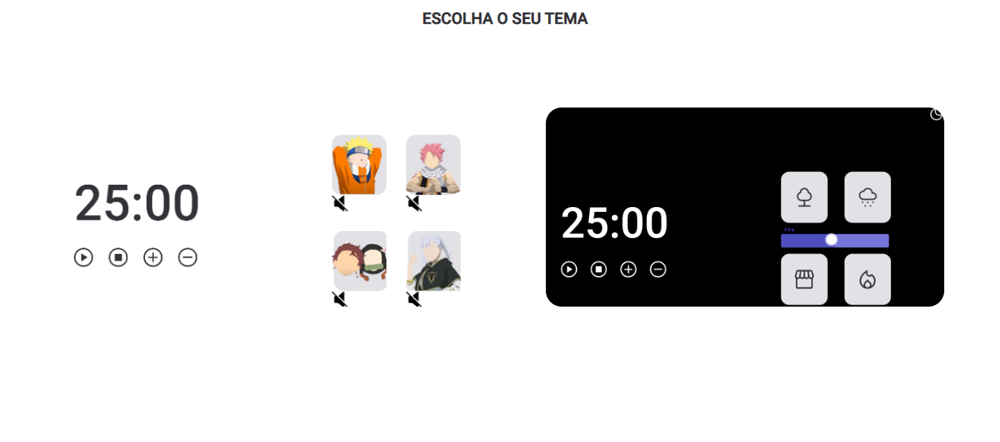

# Focus Timer - 2.0

- Projeto feito durante o estágio 5 do explorer 
- Utilização de HTML, CSS E Javascript 

- Estrutura de dados HTML
- Animações com CSS
- Funções no Javascript
- Manipulação da DOM
- Arrays
- Utilização de DOM
- Audio
- ES6 Modules
- Refatoração

Deploy: https://focus-timer2.vercel.app/

Preview: 
